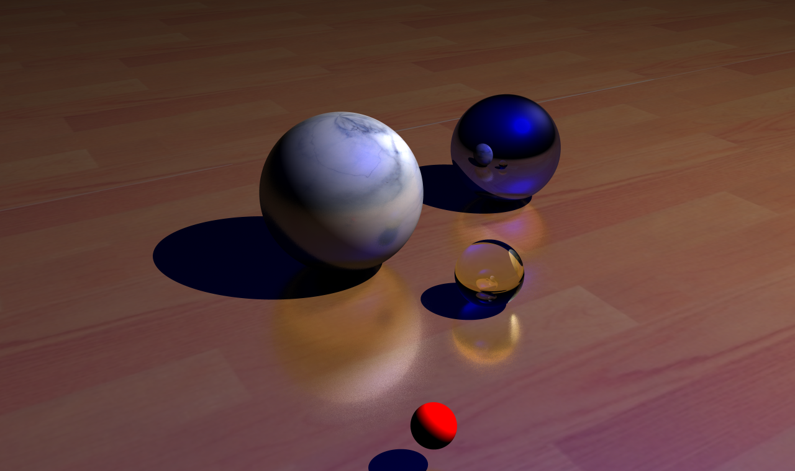
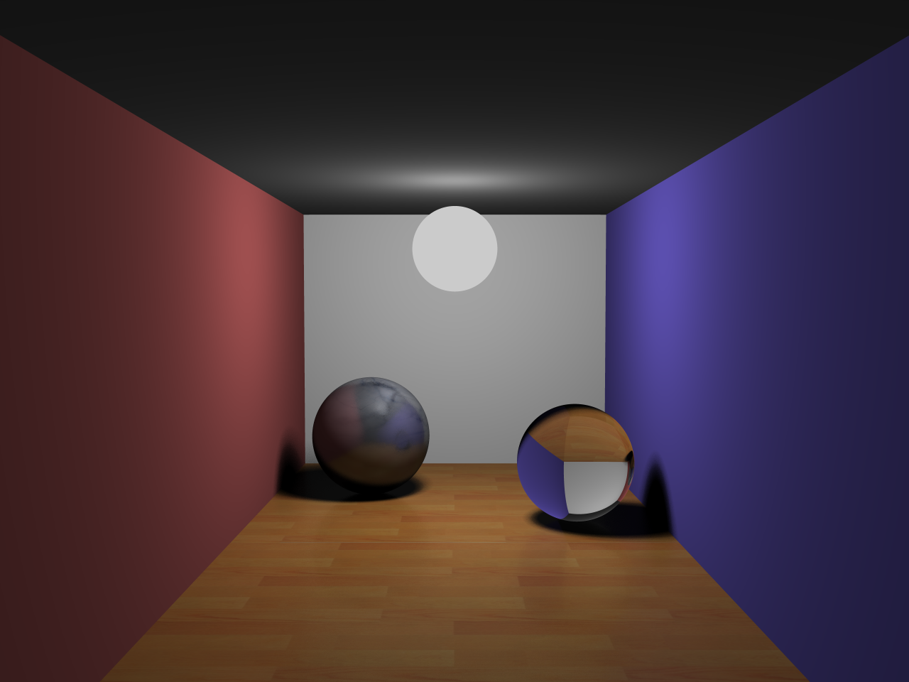
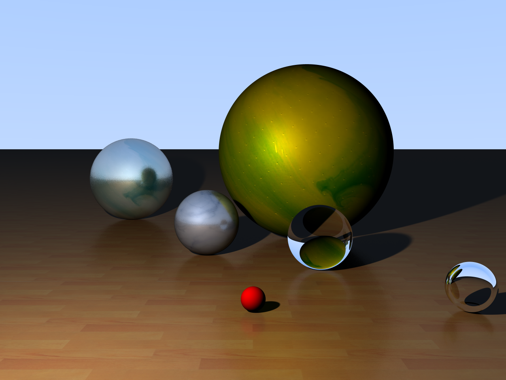

# Final Project of Fundamentals of Computer Graphics: Ray Tracing

    

# Compilation

This project and all of my CG projects will be compiled with CMake, if you open the project directly with Visual Studio, you should be able to directly compile it.
Though, as CMake permits it, you will be easily able to compile on other platforms.

# Demonstration

## Content

For my Assignment, I got all these points covered:

- Mesh Subdivision implemented with the Loop Subdivision Method
- Mesh Simplification implemented with the Quadric Error Metrics method
- Bonus:
    - Display Mode (Vertices, Wireframe, Faces)
    - Enable/Disable GUI
    - X,Y,Z axis are displayed (in the bottom-left corner) to know where the models movement will occur
    - Mesh Simplification/Subdivision is multithreaded, so the process can be seen in realtime
    - Almost all properties of entities/mesh... are editable

## How to use it

You can launch the `Raytracer.exe` directly, if you already have Visual C++ Redistribuable.

The program was compiled in Release mode.

As it is displayed in the program, here are the controls by order of priority for the assignment:

